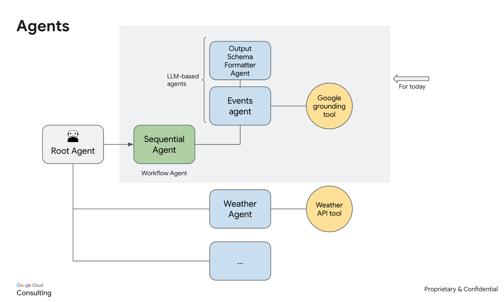
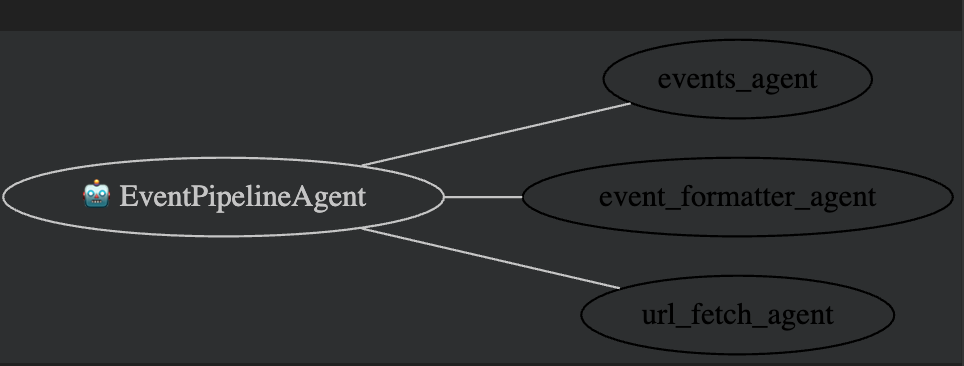

# **Events Agent**

This repository contains the code for an Events Agent, designed to provide information about events happening around the world. It leverages Google ADK (Agent Development Kit) for agent orchestration, google\_search for data grounding, and BigQuery for data storage.

## **Features**

* **Event Information Retrieval**: Uses google\_search to find current events based on user queries (destination, dates, event name, category).  
* **Categorized Event Data**: Covers a wide range of event categories including Arts & Culture, Food & Drink, Sports, Community & Local, Seasonal & Holiday, Business & Professional, Academic & Educational, Health & Wellness, and Hobbies & Special Interests.  
* **Structured Output**: Formats event data into a standardized JSON structure including event name, description, dates, location, URL, and category.  
* **BigQuery Integration**: Inserts retrieved event data into a BigQuery table for persistence and further analysis.  
* **Google ADK Powered**: Built with Google ADK for robust agent development and management.

## **Architecture Diagram**

### Component Details

## **Setup and Installation**

### **Prerequisites**

Before you begin, ensure you have the following:

* A Google Cloud Project.  
* BigQuery API enabled in your Google Cloud Project.  
* Authentication configured for your Google Cloud environment (e.g., gcloud auth application-default login).  
* Python 3.8+ installed.

### **Project Setup**

1. Copy .env.example file as .env 

    Set your Google Cloud Project ID and Location:  
   Update the PROJECT\_ID and LOCATION variables in the .env file:  
   PROJECT\_ID \= "Project_id"  \# Replace with your GCP Project ID  
   LOCATION \= "us-central1" \# Replace with your preferred GCP region

2. BigQuery Table Configuration:  
   Ensure you have a BigQuery dataset and table created for storing event data. Update the table\_id variable in the in .env with your BigQuery table path:  
   \# Example: table\_id \= "your-gcp-project-id.your\_bigquery\_dataset.events\_agent"  

   The table schema should be compatible with the Event output schema, including columns for destination, name, description, start\_date, end\_date, location, url, and category.

3. Update the places API key in .env. We use Places env to create unique_id for eah event based on location, start_date and end_date

### **Installing Libraries**

Install the necessary Python libraries using pip:

\pip install -r requirements.text

## **Agent Details**

The system consists of a sequential agent pipeline:

1. **events\_agent**:  
   * **Model**: gemini-2.0-flash  
   * **Description**: Identifies event locations, uses google\_search to find events across various categories, and extracts detailed event information.  
   * **Tools**: google\_search  
   * **Input Schema**: EventsInput (destination, start\_date, end\_date, event, category)  
   * **Output Key**: DATA  
2. **event\_formatter\_agent**:  
   * **Model**: gemini-2.0-flash  
   * **Description**: Formats the raw event data (DATA) into a structured EventsOutput schema.  
   * **Output Schema**: EventsOutput (list of Event objects)  
   * **Output Key**: formatted\_data  
3. **url\_fetch\_agent**:  
   * **Model**: gemini-2.0-flash  
   * **Description**: This agent's primary role is to process the formatted\_data (though its current implementation with map\_tool returns the input as is, it's set up to potentially fetch unique IDs or additional details for each event).  
   * **Tools**: map\_tool (a custom tool for potential future use with a mapping service).  
   * **Input Schema**: EventsOutput  
4. **event\_pipeline\_agent**:  
   * **Type**: Sequential Agent  
   * **Sub-agents**: events\_agent, event\_formatter\_agent, url\_fetch\_agent  
   * **Functionality**: Orchestrates the flow of data through the individual agents.

## **BigQuery Integration**

The insert\_to\_bq function handles inserting the processed event data into your specified BigQuery table. It converts date strings to datetime.date objects suitable for BigQuery's DATE type.

## **Usage**

To run the agent and insert data into BigQuery:

1. **Define your query payload**:  
   payload \= {  
       "destination": "SEA", \# e.g., "NYC", "London"  
       "start\_date": "06/15/2025",  
       "end\_date": "06/30/2025",  
       "event": "Grand Prix" \# Optional  
   }

2. **Call the agent**:  
 
3. **Insert data to BigQuery**:  
   \# Ensure events\_json is properly parsed before calling insert\_to\_bq  
   events\_json \= events\_json.lstrip("\`\`\`json").rstrip("\`\`\`")  
   json\_data \= json.loads(events\_json)  
   insert\_to\_bq(table\_id, json\_data)

## **License**

This project is licensed under the Apache License, Version 2.0 \- see the LICENSE file for details.

Copyright 2025 Google LLC

Licensed under the Apache License, Version 2.0 (the "License");  
you may not use this file except in compliance with the License.  
You may obtain a copy of the License at

    http://www.apache.org/licenses/LICENSE-2.0

Unless required by applicable law or agreed to in writing, software  
distributed under the License is distributed on an "AS IS" BASIS,  
WITHOUT WARRANTIES OR CONDITIONS OF ANY KIND, either express or implied.  
See the License for the specific language governing permissions and  
limitations under the License.  
